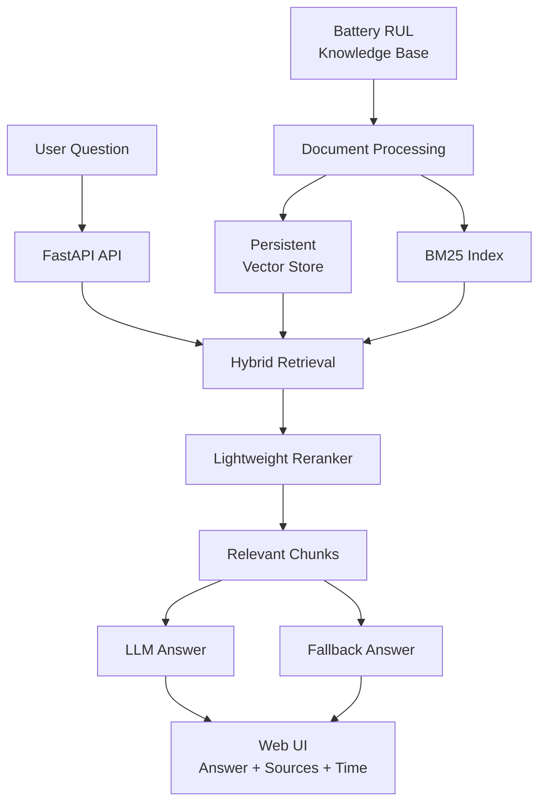
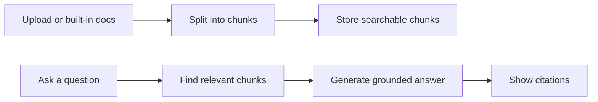

# Battery Technical Document RAG Assistant

**언어:** [English](./README.md) | 한국어

Battery RUL AI Inference System의 실험 메모, 데이터 품질 기준, 모델 추론·운영 문서를 검색하고 근거 기반 답변을 제공하는 technical document RAG service입니다.

배터리 RUL 예측 모델을 실제 운영 관점에서 검토하려면 예측값뿐 아니라 데이터 품질, 실험 조건, 관측 비율, uncertainty, 검증 기준을 함께 확인해야 합니다. 이 서비스는 Battery RUL 프로젝트에서 반복적으로 확인해야 하는 기술 문서를 knowledge base로 구성하고, 질문에 맞는 근거 문서를 검색해 답변과 citation을 함께 제공합니다.

## Demo

- Live Demo: [Hugging Face Space](https://huggingface.co/spaces/onekindalpha/battery-technical-document-rag)
- Related Portfolio: [Battery RUL AI Inference System](https://github.com/onekindalpha/battery-rul-ai-inference-system)

https://github.com/user-attachments/assets/96a7f969-18e0-41b3-989d-c8e688102889

## What It Does

이 프로젝트는 Battery RUL monitoring workflow를 위한 technical document assistant입니다.

사용자는 다음 내용을 확인할 수 있습니다.

- early-cycle RUL prediction 전에 확인해야 할 항목
- dashboard에서 RUL과 SoH를 해석하는 방법
- model review에서 uncertainty band가 필요한 이유
- prediction result가 이상해 보일 때 점검할 항목
- 특정 답변을 뒷받침하는 technical note와 source citation

목표는 prediction model을 대체하는 것이 아니라, model review와 운영 검토를 searchable technical context로 보조하는 것입니다.

## Key Features

- Built-in Battery RUL knowledge base
- Markdown, PDF, TXT document ingestion
- Chunk-based retrieval with source citation
- Local persistent vector store with optional Chroma backend
- BM25 + dense hybrid retrieval with lightweight reranking
- hit@k, MRR, precision@k 기반 retrieval evaluation
- Groq-powered grounded answer generation
- LLM API unavailable 상황의 retrieval-only fallback
- FAQ cache
- Optional API key authentication
- SQLite request logging
- Optional Redis answer cache
- Response mode and response time display
- FastAPI backend with lightweight web interface
- Docker and Docker Compose deployment setup

## Architecture

## System Flow

## Implementation Notes

- **Retrieval first**: 질문을 바로 LLM에 보내지 않고, 먼저 관련 문서 chunk를 검색합니다.
- **Hybrid retrieval**: dense retrieval 후보와 BM25 lexical 후보를 결합한 뒤, query overlap 기반 reranking으로 최종 근거를 고릅니다.
- **Grounded generation**: 검색된 근거 문맥을 LLM prompt에 포함해 답변을 생성합니다.
- **Citation UI**: 답변에 사용된 문서명과 chunk 번호를 함께 표시합니다.
- **Retrieval evaluation**: expected source 기준으로 hit@k, MRR, precision@k를 계산해 검색 품질을 확인합니다.
- **Fallback design**: LLM API key가 없거나 rate limit이 발생해도 검색 결과를 기반으로 검토할 수 있습니다.
- **Backend operations**: API key 인증, SQLite request log, Redis cache, Docker Compose 구성을 통해 운영형 백엔드 구조로 확장했습니다.

## Tech Stack

- Backend: FastAPI, Uvicorn
- RAG: custom document processor, persistent vector store, optional Chroma backend, hashing embedding, BM25 + dense hybrid retrieval, lightweight reranking
- LLM: Groq API
- Auth/DB/Cache: optional API key authentication, SQLite request log, Redis answer cache
- Frontend: server-rendered lightweight HTML/CSS/JavaScript
- Deployment: Docker, Docker Compose, Hugging Face Spaces

## Knowledge Base

데모에는 Battery RUL model review를 위한 compact public demo corpus가 포함되어 있습니다.

- Battery RUL project overview
- Data quality checklist
- Modeling and inference design notes
- Battery monitoring application notes
- Deployment and operations notes
- RUL and SoH basics

## Development Notes

로컬 실행, API 예제, retrieval evaluation request, environment variables, Docker Compose usage, security note는 [DEVELOPMENT.md](./DEVELOPMENT.md)에 분리했습니다.

## Portfolio Context

이 레포는 Battery RUL AI Inference System과 연결됩니다.

- Battery RUL AI Inference System: model inference, API, dashboard, deployment
- Battery Technical Document RAG: technical document search, grounded answer generation, source-based review support

두 레포를 함께 보면 AI application의 model-serving side와 technical-support/documentation side를 모두 보여줄 수 있습니다.
