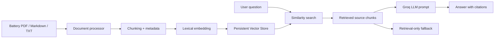

# Battery Technical Document RAG Assistant

Battery RUL AI Inference System에서 확장한 기술문서 RAG Assistant입니다. 배터리 RUL 프로젝트의 README, 실험 메모, 논문 요약, 데이터 검증 기준, BMS 운영 관점 문서를 검색하고, 관련 근거 chunk를 기반으로 답변을 생성합니다.

이 프로젝트는 단순 챗봇이 아니라, Battery RUL 예측 시스템 운영 과정에서 데이터 품질, 예측 결과, 실험 기준, PoC 방향을 검토하기 위한 **RAG 기반 Research Copilot MVP**로 설계했습니다. 현재는 문서 업로드, chunking, 검색, citation 기반 답변을 구현했으며, 향후 운영 점검 요약, 데이터 누수 체크리스트 생성, 예측 이상 원인 분석, 다음 실험 설계 같은 agentic workflow로 확장할 수 있습니다.

## Why this project

기존 [Battery RUL AI Inference System](https://github.com/onekindalpha/battery-rul-ai-inference-system)은 시계열 기반 RUL 예측 결과를 API·대시보드·배포 환경으로 연결합니다. 이 프로젝트는 그 위에 기술문서 검색 계층을 추가해, 모델 설계 의도와 데이터 검증 기준을 문서 근거와 함께 설명할 수 있도록 만든 별도 AI service PoC입니다.

Battery RUL 모델은 모델 성능 수치만으로 운영 활용성을 설명하기 어렵습니다. 초기 cycle 기반 예측에서는 데이터 누수 여부, 배터리별 실험 조건 차이, 관측 비율, feature 품질, 불확실성 표시 방식까지 함께 검토해야 합니다. 이 RAG Assistant는 이러한 판단 기준을 문서화하고, 질문이 들어오면 관련 근거를 찾아 답변하는 흐름을 구현합니다.

## Features

- PDF, Markdown, TXT 기술문서 업로드
- 문서 정규화, chunk 분할, metadata 생성
- Lightweight lexical embedding
- JSON-backed persistent vector store with cosine similarity search
- cosine similarity 기반 근거 검색
- Groq LLM 기반 RAG 답변 생성
- 답변별 문서명·chunk 번호 표시
- API 키가 없는 환경을 위한 retrieval-only fallback
- FastAPI API와 lightweight web UI
- Docker 기반 실행
- 예시 질문 기반 portfolio demo flow

## What this project demonstrates

이 프로젝트는 RAG를 단순 API 호출 기능으로만 사용하지 않고, 다음 흐름을 직접 구현하고 설명하는 것을 목표로 합니다.

1. **검색 기반 생성(RAG) 시스템 동작 원리 이해**
   - 사용자의 질문을 그대로 LLM에 전달하지 않고, 먼저 관련 문서 chunk를 검색합니다.
   - 검색된 근거 문맥을 LLM prompt에 함께 넣어 답변을 생성합니다.
   - 답변과 함께 source chunk를 표시해 hallucination 위험을 줄이고 검증 가능성을 높입니다.

2. **RAG 시스템 구현**
   - PDF, Markdown, TXT 문서를 읽고 chunk 단위로 분할합니다.
   - chunk마다 metadata를 생성하고, lightweight lexical embedding으로 검색 벡터를 구성합니다.
   - persistent vector store에 저장한 뒤, 질문과 유사한 문서 구간을 cosine similarity로 검색합니다.
   - 검색 결과를 Groq LLM에 전달해 grounded answer를 생성합니다.

3. **현업 적용 관점**
   - 사내 기술문서, 운영 매뉴얼, 실험 기록, 논문 요약, PoC 검토 문서를 검색하는 기술지원형 AI 서비스로 확장할 수 있습니다.
   - Battery RUL 예측 시스템 운영 관점에서는 데이터 품질 점검, 예측 결과 해석, 실험 조건 검토, 모델 개선 방향 검토에 활용할 수 있습니다.
   - 향후 agentic workflow를 붙이면 운영 점검 요약, 데이터 누수 체크리스트 작성, 예측 이상 원인 분석, 다음 실험 설계 같은 업무 보조 기능으로 확장할 수 있습니다.

## Architecture



## Run locally

Python 3.11 or 3.12 is recommended.

```bash
python -m venv .venv
source .venv/bin/activate
pip install -r requirements.txt
cp .env.example .env
python -m app.main
```

Open `http://localhost:7860`.

## API

```bash
curl http://localhost:7860/api/health

curl -X POST http://localhost:7860/api/ask \
  -H 'Content-Type: application/json' \
  -d '{"question":"초기 cycle 기반 RUL 예측에서 확인할 항목은 무엇인가요?"}'
```

Interactive API documentation is available at `http://localhost:7860/docs`.

## Environment variables

| Variable | Description |
| --- | --- |
| `GROQ_API_KEY` | Optional. Enables generated RAG answers. |
| `GROQ_MODEL` | Groq chat model identifier. |
| `VECTOR_STORE_PATH` | Local vector store persistence path. |
| `EMBEDDING_MODEL` | Embedding mode label. |
| `TOP_K` | Number of retrieved source chunks. |
| `CHUNK_SIZE` | Character length of each chunk. |
| `CHUNK_OVERLAP` | Overlap between adjacent chunks. |

`data/sample_docs`에는 공개 데모를 위한 짧은 배터리 RUL 설명 문서가 포함되어 있습니다. 논문 원문을 복제하지 않고, 프로젝트에서 확인한 문제의식과 운영 관점을 직접 정리한 샘플 코퍼스입니다.

## Portfolio scope

This repository is intentionally separate from the Battery RUL inference repository. It demonstrates a second AI service pattern:

1. Inference application: time-series model serving and visualization
2. Document RAG application: ingestion, retrieval, grounded generation, and citations
3. Research Copilot direction: operation review, data quality checklist generation, anomaly cause analysis, and experiment planning

## Security note

Do not commit API keys. Store secrets only in `.env` locally or in the deployment platform's secret manager.
