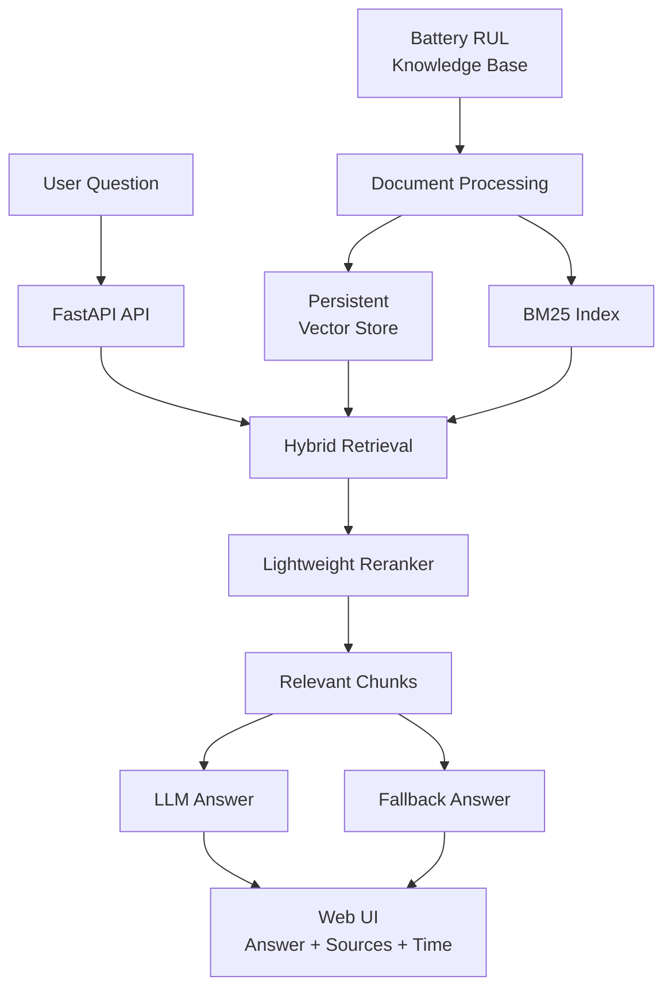
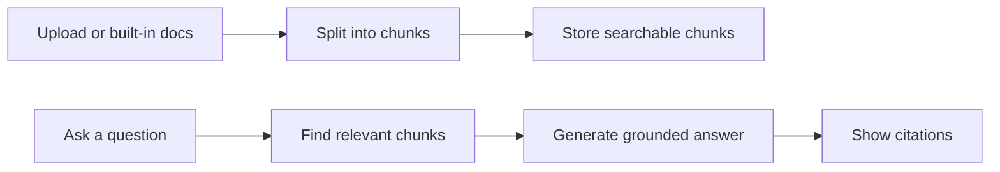

# Battery Technical Document RAG Assistant

Battery RUL AI Inference System의 실험 메모, 데이터 품질 기준, 모델 추론·운영 문서를 검색하고 근거 기반 답변을 제공하는 technical document RAG service입니다.

배터리 RUL 예측 모델을 실제 운영 관점에서 검토하려면 예측값뿐 아니라 데이터 품질, 실험 조건, 관측 비율, uncertainty, 검증 기준을 함께 확인해야 합니다. 이 서비스는 Battery RUL 프로젝트에서 반복적으로 확인해야 하는 기술 문서를 knowledge base로 구성하고, 질문에 맞는 근거 문서를 검색해 답변과 citation을 함께 제공합니다.

## Demo

- Live Demo: [Hugging Face Space](https://huggingface.co/spaces/onekindalpha/battery-technical-document-rag)
- Related Portfolio: [Battery RUL AI Inference System](https://github.com/onekindalpha/battery-rul-ai-inference-system)

https://github.com/user-attachments/assets/96a7f969-18e0-41b3-989d-c8e688102889

## What It Does

This project works as a technical document assistant for a Battery RUL monitoring workflow.

It helps users check:

- what to verify before early-cycle RUL prediction
- how RUL and SoH should be interpreted in a dashboard
- why uncertainty bands are useful for model review
- what to check when a prediction result looks abnormal
- which technical notes support a specific answer

The goal is not to replace the prediction model, but to support model review and operation with searchable technical context.

## Key Features

- Built-in Battery RUL knowledge base
- Markdown, PDF, and TXT document ingestion
- Chunk-based retrieval with source citation
- Local persistent vector store with optional Chroma backend
- BM25 + dense hybrid retrieval with lightweight reranking
- Retrieval evaluation endpoint with hit@k, MRR, and precision@k
- Groq-powered grounded answer generation
- Retrieval-only fallback when the LLM API is unavailable
- FAQ cache for repeated operational questions
- Optional API key authentication for protected endpoints
- SQLite request logging for operational review
- Optional Redis answer cache for repeated questions
- Response mode and response time display
- FastAPI backend with a lightweight web interface
- Docker and Docker Compose deployment setup

## Architecture



## System Flow



## Implementation Notes

- **Retrieval first**: 질문을 바로 LLM에 보내지 않고, 먼저 관련 문서 chunk를 검색합니다.
- **Hybrid retrieval**: dense retrieval 후보와 BM25 lexical 후보를 결합한 뒤, query overlap 기반 reranking으로 최종 근거를 고릅니다.
- **Grounded generation**: 검색된 근거 문맥을 LLM prompt에 포함해 답변을 생성합니다.
- **Citation UI**: 답변에 사용된 문서명과 chunk 번호를 함께 표시합니다.
- **Retrieval evaluation**: expected source 기준으로 hit@k, MRR, precision@k를 계산해 검색 품질을 확인합니다.
- **Fallback design**: LLM API key가 없거나 rate limit이 발생해도 검색 결과를 기반으로 검토할 수 있습니다.
- **Backend operations**: API key 인증, SQLite request log, Redis cache, Docker Compose 구성을 통해 운영형 백엔드 구조로 확장했습니다.
- **Operational UX**: 자주 묻는 질문 버튼, response time 표시, indexed source 목록을 통해 운영 도구처럼 사용할 수 있도록 구성했습니다.

## Tech Stack

- Backend: FastAPI, Uvicorn
- RAG: custom document processor, persistent vector store, optional Chroma backend, hashing embedding, BM25 + dense hybrid retrieval, lightweight reranking
- LLM: Groq API
- Auth/DB/Cache: optional API key authentication, SQLite request log, Redis answer cache
- Frontend: server-rendered lightweight HTML/CSS/JavaScript
- Deployment: Docker, Docker Compose, Hugging Face Spaces

## Knowledge Base

The demo includes short internal-style notes for Battery RUL model review:

- Battery RUL project overview
- Data quality checklist
- Modeling and inference design notes
- Battery monitoring application notes
- Deployment and operations notes
- RUL and SoH basics

These documents are written as a compact public demo corpus, not as copies of the original papers or private project files.

## Run locally

Python 3.11 or 3.12 is recommended.

```bash
python -m venv .venv
source .venv/bin/activate
pip install -r requirements.txt
cp .env.example .env
python -m app.main
```

Open `http://localhost:7860`.

Run with Docker Compose:

```bash
docker compose up --build
```

This starts the FastAPI app and a Redis container for answer caching.

## API

```bash
curl http://localhost:7860/api/health

curl -X POST http://localhost:7860/api/ask \
  -H 'Content-Type: application/json' \
  -d '{"question":"초기 cycle 기반 RUL 예측에서 확인할 항목은 무엇인가요?"}'
```

Interactive API documentation is available at `http://localhost:7860/docs`.

### Retrieval evaluation

```bash
curl -X POST http://localhost:7860/api/eval/retrieval \
  -H 'Content-Type: application/json' \
  -d '{
    "top_k": 3,
    "cases": [
      {
        "question": "RUL과 SoH는 무엇이 다른가요?",
        "expected_sources": ["battery_rul_basics.md"]
      }
    ]
  }'
```

When `API_AUTH_TOKEN` is set, protected endpoints require:

```bash
-H 'X-API-Key: your-api-token'
```

## Environment variables

| Variable | Description |
| --- | --- |
| `GROQ_API_KEY` | Optional. Enables generated RAG answers. |
| `GROQ_MODEL` | Groq chat model identifier. |
| `API_AUTH_TOKEN` | Optional. Enables API key protection for ask, ingest, and evaluation endpoints. |
| `VECTOR_BACKEND` | `local` or `chroma`. Defaults to `local` for demo stability. |
| `VECTOR_STORE_PATH` | Local vector store persistence path. |
| `EMBEDDING_MODEL` | Embedding mode label. |
| `REQUEST_LOG_DB_PATH` | SQLite path for API request logs. |
| `REDIS_URL` | Optional Redis URL for answer cache. |
| `TOP_K` | Number of retrieved source chunks. |
| `CHUNK_SIZE` | Character length of each chunk. |
| `CHUNK_OVERLAP` | Overlap between adjacent chunks. |

## Portfolio Context

This repository is connected to the Battery RUL AI Inference System portfolio.

- Battery RUL AI Inference System: model inference, API, dashboard, and deployment
- Battery Technical Document RAG: technical document search, grounded answer generation, and source-based review support

Together, the two repositories show both the model-serving side and the technical-support/documentation side of an AI application.

This repository is positioned as a backend-oriented LLM application: document ingestion, retrieval, citation-based answers, retrieval quality evaluation, API authentication, request logging, cache design, and containerized deployment.

## Security note

Do not commit API keys. Store secrets only in `.env` locally or in the deployment platform's secret manager.
