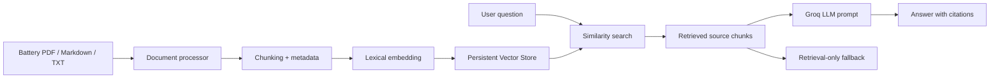

# Battery Technical Document RAG Assistant

배터리 RUL 예측 프로젝트에서 확장한 도메인 문서 검색·질의응답 서비스입니다. 배터리 기술문서를 업로드하면 문서를 chunk 단위로 분할하고, lightweight lexical embedding과 cosine similarity 기반 persistent vector store를 사용해 질문과 유사한 근거 구간을 검색합니다. `GROQ_API_KEY`가 설정된 경우 검색 문맥을 기반으로 답변을 생성하며, API 키가 없어도 검색 결과와 출처를 확인할 수 있습니다.

## Why this project

기존 [Battery RUL AI Inference System](https://github.com/onekindalpha/battery-rul-ai-inference-system)은 시계열 기반 RUL 예측 결과를 API·대시보드·배포 환경으로 연결합니다. 이 프로젝트는 별도 서비스로 분리하여, 배터리 운영 및 분석 과정에서 기술문서의 근거를 검색하고 답변에 연결하는 RAG 흐름을 구현합니다.

## Features

- PDF, Markdown, TXT 기술문서 업로드
- 문서 정규화, chunk 분할, metadata 생성
- Lightweight lexical embedding
- JSON-backed persistent vector store with cosine similarity search
- cosine similarity 기반 근거 검색
- Groq LLM 기반 RAG 답변 생성
- 답변별 문서명·chunk 번호 표시
- API 키가 없는 환경을 위한 retrieval-only fallback
- FastAPI API와 lightweight web UI
- Docker 기반 실행

## Architecture



## Run locally

Python 3.11 or 3.12 is recommended.

```bash
python -m venv .venv
source .venv/bin/activate
pip install -r requirements.txt
cp .env.example .env
python -m app.main
```

Open `http://localhost:7860`.

## API

```bash
curl http://localhost:7860/api/health

curl -X POST http://localhost:7860/api/ask \
  -H 'Content-Type: application/json' \
  -d '{"question":"초기 cycle 기반 RUL 예측에서 확인할 항목은 무엇인가요?"}'
```

Interactive API documentation is available at `http://localhost:7860/docs`.

## Environment variables

| Variable | Description |
| --- | --- |
| `GROQ_API_KEY` | Optional. Enables generated RAG answers. |
| `GROQ_MODEL` | Groq chat model identifier. |
| `VECTOR_STORE_PATH` | Local vector store persistence path. |
| `EMBEDDING_MODEL` | Embedding mode label. |
| `TOP_K` | Number of retrieved source chunks. |
| `CHUNK_SIZE` | Character length of each chunk. |
| `CHUNK_OVERLAP` | Overlap between adjacent chunks. |

`data/sample_docs`에는 공개 데모를 위한 짧은 배터리 RUL 설명 문서가 포함되어 있습니다. 논문 원문을 복제하지 않고, 프로젝트에서 확인한 문제의식과 운영 관점을 직접 정리한 샘플 코퍼스입니다.

## Portfolio scope

This repository is intentionally separate from the Battery RUL inference repository. It demonstrates a second AI service pattern:

1. Inference application: time-series model serving and visualization
2. Document RAG application: ingestion, retrieval, grounded generation, and citations

## Security note

Do not commit API keys. Store secrets only in `.env` locally or in the deployment platform's secret manager.
